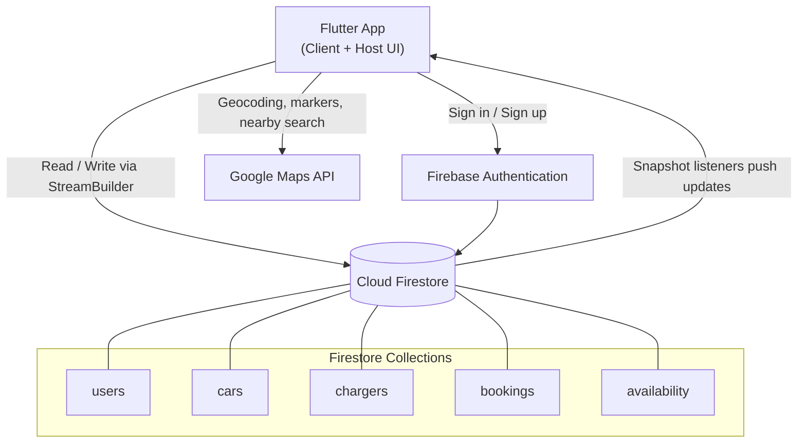

# ⚡ EV Connect

**A peer-to-peer EV charging station rental app — the Airbnb model, applied to charging infrastructure.**

[](https://flutter.dev)
[](https://dart.dev)
[](https://firebase.google.com)
[](https://developers.google.com/maps)
[](#)
[](LICENSE)

---

## Overview

EV adoption in India is growing fast, but public charging infrastructure hasn't kept up. Meanwhile, thousands of chargers already exist — in housing societies, corporate parking lots and private homes — and sit idle most of the day.

EV Connect turns those idle chargers into a shared network. Charger owners (**hosts**) list their stations on the platform; EV drivers (**clients**) discover them on a map, check live availability, and reserve a time slot. Both sides live in the same Flutter app, backed by Firebase for real-time sync.

### The problem it solves

| Issue | How EV Connect addresses it |
|---|---|
| Too few public charging stations | Unlocks private and society-owned chargers for public use |
| Private chargers sit unused | Hosts earn from otherwise idle hardware |
| No way to know if a charger is free | Firestore listeners push live status to every device |
| No scheduling — you drive there and hope | Hourly slot booking with conflict prevention |
| Range anxiety | Nearby-charger discovery with distance-sorted results |

---

## Features

### 🚗 Client side (EV users)

- **Map + list discovery** — browse nearby chargers on Google Maps or as a sortable, filterable list
- **Charger details** — price, power rating, connector type, location and live availability
- **Slot-based booking** — pick a date and hourly slot; double-booking is blocked at the source
- **Real-time status** — availability flips between *Available* and *Occupied* without a manual refresh
- **Car profile** — save battery capacity, connector type and charging power for compatibility checks
- **Booking history** — upcoming and past sessions in one place
- **Smart slot recommendations** — scored suggestions based on distance, availability and vehicle compatibility

### 🔌 Host side (charger owners)

- **List a charger** — name, location (lat/lng), power rating, pricing, connector type, operating hours
- **Availability management** — auto-generated time slots from a defined schedule
- **Slot blocking** — reserve slots for personal use or maintenance; blocked slots disappear from client view
- **Booking dashboard** — see and manage incoming reservations
- **Earnings and usage tracking**
- **Full CRUD** — edit, hide or delete listings at any time

---

## Tech stack

| Layer | Technology |
|---|---|
| Frontend | Flutter (Dart), widget-based UI, `Navigator` routing |
| Auth | Firebase Authentication |
| Database | Cloud Firestore (NoSQL, real-time listeners) |
| Storage | Firebase Storage *(reserved for charger images)* |
| Maps & geolocation | Google Maps Platform API |
| Real-time UI | `StreamBuilder` over Firestore snapshots |
| Tooling | Android Studio, Git / GitHub |

---

## Architecture

EV Connect follows a client–server model with no custom backend server — Firebase handles authentication, persistence and real-time propagation directly.



**Design principles**

- **Separation of concerns** — each module (auth, home, listings, booking, profile, host dashboard) is self-contained
- **Real-time first** — the UI subscribes to Firestore streams rather than polling
- **Reusable widgets** — shared buttons, cards and list tiles keep the UI consistent
- **Scalable collections** — Firestore documents are structured for efficient querying as listings grow
- **One app, two roles** — client and host experiences are integrated, not split into separate builds

---

## Modules

| Module | Responsibility |
|---|---|
| **Authentication** | Firebase sign-up/login, credential validation, user document creation |
| **Home** | Charger discovery with search, sort and filter; live Firestore listings |
| **Listings** | Detail view for a selected charger — price, power, location, availability |
| **Booking** | Slot selection, conflict detection, instant availability update, history |
| **Profile** | User details, role, booking history, profile editing |
| **Car Profile** | Vehicle specs used for compatibility and personalisation |
| **Host Management** | Add / edit / delete chargers, control pricing and visibility |
| **Availability Management** | Slot generation from schedules, host-side slot blocking |
| **Recommendation** | Scored ranking of optimal slots and chargers |

---

## Core logic

### Slot generation
Operating hours (e.g. `09:00–17:00`) are split into hourly intervals, each assigned a unique slot key. Slot keys are what bookings and blocks are written against, which keeps the availability check to a single document lookup.

### Booking conflict detection
Before a booking is confirmed, the selected slot key is checked against existing bookings and host-blocked slots for that charger and date. If it's taken, confirmation is refused — so two users racing for the same slot can't both succeed.

### Real-time availability
Charger status is derived from active bookings rather than stored as a manually toggled flag. Snapshot listeners propagate the change to every subscribed device the moment a booking is written.

### Distance calculation
User coordinates are compared against each charger's stored latitude/longitude to sort and filter the "nearby chargers" view.

### Recommendation scoring
A weighted score combines **distance**, **slot availability** and **charger–vehicle compatibility** (connector type and power rating against the saved car profile) to rank options for the user.

---

## Getting started

### Prerequisites

- Flutter SDK (3.x or later) — [install guide](https://docs.flutter.dev/get-started/install)
- Android Studio with the Android SDK and an emulator, or a physical Android device
- A Firebase project
- A Google Maps Platform API key with **Maps SDK for Android** enabled

### 1. Clone the repo

```bash
git clone https://github.com/<your-username>/ev-connect.git
cd ev-connect
```

### 2. Install dependencies

```bash
flutter pub get
```

### 3. Configure Firebase

Create a project at [console.firebase.google.com](https://console.firebase.google.com), then:

1. Enable **Authentication → Email/Password**
2. Create a **Cloud Firestore** database
3. Register an Android app using your `applicationId` (found in `android/app/build.gradle`)
4. Download `google-services.json` and place it in `android/app/`

Or wire it up with the FlutterFire CLI:

```bash
dart pub global activate flutterfire_cli
flutterfire configure
```

> `google-services.json` and `firebase_options.dart` contain project-specific identifiers. Keep them out of version control — see [Environment & secrets](#environment--secrets).

### 4. Add your Google Maps API key

In `android/app/src/main/AndroidManifest.xml`, inside the `<application>` tag:

```xml
<meta-data
    android:name="com.google.android.geo.API_KEY"
    android:value="YOUR_API_KEY_HERE" />
```

Also confirm location permissions are declared:

```xml
<uses-permission android:name="android.permission.ACCESS_FINE_LOCATION" />
<uses-permission android:name="android.permission.ACCESS_COARSE_LOCATION" />
<uses-permission android:name="android.permission.INTERNET" />
```

### 5. Run

```bash
flutter run
```

To build a release APK:

```bash
flutter build apk --release
```

---

## Data model

Representative Firestore structure — adjust field names to match your implementation.

```
users/{userId}
  ├─ name: string
  ├─ email: string
  ├─ phone: string
  └─ role: "client" | "host"

cars/{carId}
  ├─ userId: string
  ├─ model: string
  ├─ batteryCapacity: number
  ├─ connectorType: string
  └─ chargingPower: number

chargers/{chargerId}
  ├─ hostId: string
  ├─ name: string
  ├─ latitude: number
  ├─ longitude: number
  ├─ powerRating: number
  ├─ pricePerHour: number
  ├─ connectorType: string
  ├─ availableFrom: string      // "09:00"
  ├─ availableTo: string        // "17:00"
  └─ isActive: boolean

bookings/{bookingId}
  ├─ chargerId: string
  ├─ userId: string
  ├─ date: string               // "2026-06-14"
  ├─ slotKey: string            // "14:00-15:00"
  ├─ status: "confirmed" | "completed" | "cancelled"
  └─ createdAt: timestamp

availability/{chargerId}
  └─ blockedSlots: map          // { "2026-06-14": ["12:00-13:00", ...] }
```

### Suggested Firestore rules

```js
rules_version = '2';
service cloud.firestore {
  match /databases/{database}/documents {
    match /users/{userId} {
      allow read, write: if request.auth != null && request.auth.uid == userId;
    }
    match /chargers/{chargerId} {
      allow read: if request.auth != null;
      allow write: if request.auth != null
                   && request.resource.data.hostId == request.auth.uid;
    }
    match /bookings/{bookingId} {
      allow read: if request.auth != null;
      allow create: if request.auth != null
                    && request.resource.data.userId == request.auth.uid;
    }
  }
}
```

> These are a starting point, not production-hardened rules. Tighten them before any public deployment.

---

## Project structure

```
lib/
├─ main.dart
├─ models/              # User, Car, Charger, Booking data classes
├─ screens/
│  ├─ auth/             # Login, signup
│  ├─ client/           # Home, map, listing detail, booking, history
│  ├─ host/             # Dashboard, add/edit charger, availability, bookings
│  └─ profile/          # User profile, car profile
├─ services/            # Firebase auth, Firestore queries, location services
├─ widgets/             # Reusable buttons, cards, list tiles
└─ utils/               # Slot generation, distance calc, scoring, constants

android/
└─ app/
   ├─ google-services.json        # not committed
   └─ src/main/AndroidManifest.xml
```

*Adjust to match your actual tree.*

---

## Environment & secrets

Add this to `.gitignore` before your first push:

```gitignore
# Firebase
android/app/google-services.json
ios/Runner/GoogleService-Info.plist
lib/firebase_options.dart

# Flutter
.dart_tool/
.packages
build/
*.iml
.idea/

# Local config
*.env
local.properties
```

If a key has already been pushed, rotate it in the Google Cloud Console — removing it from a later commit doesn't remove it from history.

---

## Screenshots

| Login | Home / Map | Charger Detail |
|---|---|---|
|  |  |  |

| Slot Booking | Host Dashboard | Profile |
|---|---|---|
|  |  |  |

*Drop your screenshots into `docs/screenshots/` — the table renders once the files exist.*

---

## Testing & results

The app was validated on Android emulators across multiple screen sizes and on physical devices, over both Wi-Fi and 4G, against a live Firebase project.

| Metric | Outcome |
|---|---|
| Real-time availability accuracy | Status updated instantly in Firestore; other users saw the change without refreshing |
| Booking conflict handling | Simultaneous attempts on the same slot were correctly rejected — no overlaps |
| Response time | Booking actions propagated to other devices with no perceptible delay |
| Map rendering | Markers loaded at accurate coordinates; nearby-charger discovery worked reliably |
| UI responsiveness | Navigation stayed smooth with live listeners running in the background |
| Host management | Add/edit/delete, availability and booking tracking all synced in real time |

---

## Limitations

- **No payment gateway** — bookings are confirmed but transactions aren't processed in-app
- **No admin panel** — no dashboard for charger verification, user management or analytics
- **Android only** — iOS builds are untested
- **No push notifications** — no alerts for upcoming bookings or availability changes
- **Requires connectivity** — the real-time model depends on a stable internet connection; there's no offline mode

---

## Roadmap

- [ ] Payment integration (UPI, cards, wallets) with automatic host payouts
- [ ] Push notifications via Firebase Cloud Messaging
- [ ] Admin dashboard for verification, usage statistics and complaint handling
- [ ] ML-based recommendations using booking history and availability trends
- [ ] Integration with public EV networks (Tata Power, Statiq, ChargeZone)
- [ ] Web build for broader reach
- [ ] iOS support
- [ ] Charger images via Firebase Storage
- [ ] Ratings and reviews for hosts and chargers

---

## Contributing

Contributions are welcome.

1. Fork the repo
2. Create a branch — `git checkout -b feature/your-feature`
3. Commit — `git commit -m "Add your feature"`
4. Push — `git push origin feature/your-feature`
5. Open a pull request

Run `flutter analyze` and `dart format .` before submitting.

---

## Author

**Dhurva Saxena** — 23001011020
B.Tech, Information Technology — Department of Computer Engineering
Faculty of Informatics & Computing
J.C. Bose University of Science & Technology, YMCA, Faridabad

Capstone project, 6th semester (Jan–June 2026), under the supervision of **Dr. Poonam**, Associate Professor, Department of Computer Engineering.

---

## References

1. S. Hemavathi, A. Shinisha, "A study on trends and developments in electric vehicle charging technologies," *Journal of Energy Storage*, Vol. 52, Part C, 2022.
2. Y. Zhang, P. You, L. Cai, "Optimal Charging Scheduling by Pricing for EV Charging Station With Dual Charging Modes," *IEEE Transactions on Intelligent Transportation Systems*, Vol. 20, Sept. 2019.
3. S. S. G. Acharige et al., "Review of Electric Vehicle Charging Technologies, Standards, Architectures, and Converter Configurations," *IEEE Access*, Vol. 11, 2023.
4. R. Hema, M. J. Venkatarangan, "Adoption of EV: Landscape of EV and opportunities for India," *Measurement: Sensors*, Vol. 24, 2022.

---

## License

Released under the MIT License. See [LICENSE](LICENSE) for details.

---

## Acknowledgements

- Dr. Poonam, for supervision and guidance throughout the project
- J.C. Bose University of Science & Technology, YMCA, Faridabad
- The Flutter and Firebase teams for their documentation and tooling
